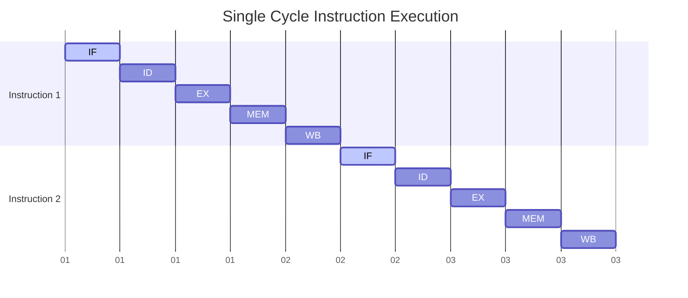
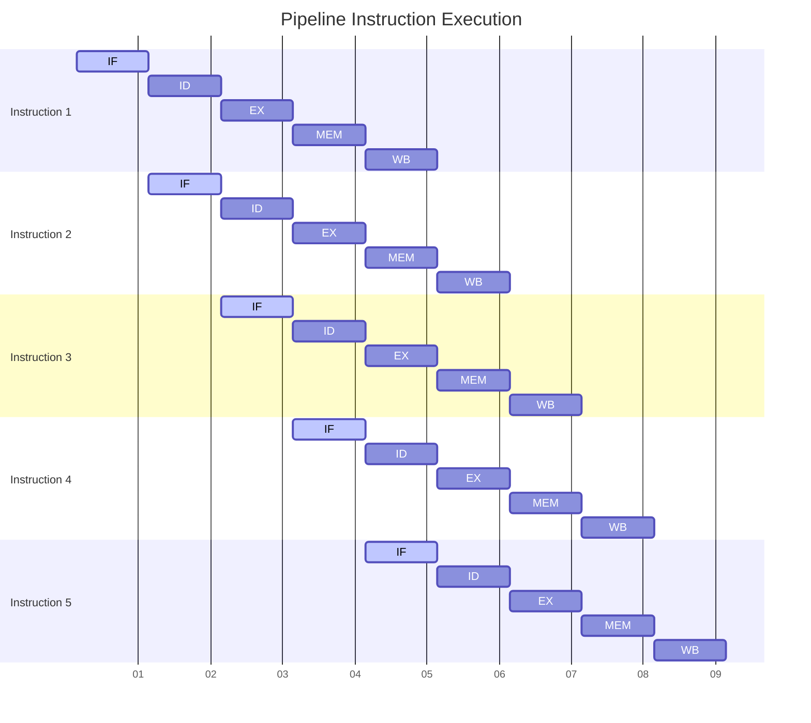

---
categories:
- Computer Architecture
createdAt: '2024-06-04'
description: '- `Single cycle` mechanism only allows instructions to be processed
 one at a time'
tags:
- Computer Architecture
title: 3. Pipeline
---
# Pipeline


## What is pipeline?
- `Single cycle` mechanism only allows instructions to be processed one at a time
- `Pipeline` uses more throughput to allow instructions to be processed `in parallel`.

> [!CAUTION]
> Pipeline _**DOES NOT**_ decrease latency, and may increases it.
## Instruction Stage
1. `IF`: Instruction Fetching
2. `ID`: Instruction Decoding
3. `EX`: Execution
4. `MEM`: Memory Accessing
5. `WR`: Write back to register

> [!NOTE]
> Each stage takes `1` cycle


## Single Cycle vs Pipeline

### Single Cycle

- Instructions will only be fetched when the previous instruction is done.



### Pipeline

- Instructions will be fetched once the previous one has moved on to the `ID` phase



## Pipeline Speedup

- If all stages are `balanced`

$$Speed\ Up = \frac{time\ between\ instructions}{\#\ of stages}$$

- If not balanced

$$Speed\ Up = \frac{max\ time\ between\ instructions}{\#\ of stages}$$

## What makes MIPS / RISC-V suitable for pipeline

- All instructions are `32-bits`
- Few instructions and regular formats
- Calculate `address` at `3rd` stage and access `memory` at `4th` stage
- Memory alignment
 - memory access only takes `1` cycle
 
## Hazard

*The situations where the next instruction cycle is prevented*

- Structure Hazard
- Data Hazard
- Control Hazard

## Structure Hazard

- A required source is `busy`
- Take place in systems with `single memory`
- e.g. `load/store` instructions need memory access
 - `IF` and `ID` needs to wait until the previous instruction is done with memory access

> [!IMPORTANT]
> This is the reason why separating instruction memory and main memory is required.

## Data Hazard

- The next instruction needs to **wait** for the previous one completing its data read/write
- `stall` happens here.

### Data hazard for arithmetic instructions

- use `forwarding` to resolve this hazard
- Use the result once it is calculated

#### With stalling 
- wait until `WB`

```bash
add $s0, $t0, $t1 # IF ID EX MEM WB
 # /// BUBBLE ///
 # /// BUBBLE ///
sub $s1, $s0, $t2 # IF ID EX MEM WB
```

#### With forwarding

- no stalling

```bash
add $s0, $t0, $t1 # IF - ID - EX -|- MEM - WB
sub $s1, $s0, $t2 # IF - ID _|_ EX - MEM - WB
```

>[!WARNING]
> Stalling happens since the second `sub` instruction needs to wait until the `add` instruction `WB` to `EX` the operation.

### Data hazard for load/store instruction

- use `stalling` + `forwarding` to resolve

#### With stalling

- wait until `WB`

```bash
ld $s0, 0($t1) # IF ID EX MEM WB
 # /// BUBBLE ///
 # /// BUBBLE ///
sub $s1, $s0, $t2 # IF ID EX MEM WB
```

#### With forwarding

> [!CAUTION]
> Forwarding does not work since the value has not been fetched from memory
>
> ```bash
> add $s0, $t0, $t1 # IF - ID - EX - MEM -|- WB
> sub $s1, $s0, $t2 # IF - ID _|_ EX - MEM - WB
> ```

#### With forwarding and stalling

```bash
add $s0, $t0, $t1 # IF - ID - EX - MEM -|- WB
 # /// BUBBLE /// |
sub $s1, $s0, $t2 # IF - ID _|_ EX - MEM - WB
```

### Prevent stalling by rearranging code


### Control Hazard

- `IF` depends on `branch` result
 - This way, `IF` knows which instruction to fetch
- Require extra hardware to calculate the result in `ID` stage

#### Solutions

- `stall` on branch
- Branch prediction
 - since longer pipeline induces **unacceptable** `stall penalty`
 - predict outcome of branch and only `stall` when the prediction is `wrong`


## Forwarding Conditions 

### EX Hazards

- Forward A = `10`
 ```ts
 EX/MEM.RegWrite
 && EX/MEM.RegisterRd!= 0
 && EX/MEM.RegisterRd == ID/EX.RegisterRs
 ```
- Forward B = `10`
 ```ts
 EX/MEM.RegWrite
 && EX/MEM.RegisterRd!= 0
 && EX/MEM.RegisterRD == ID/EX.RegisterRt
 ```
 
### Mem Hazards

- Forward A = `01`
 ```ts
 MEM/WB.RegWrite
 && MEM/WB.RegisterRd!= 0
 && MEM/WB.RegisterRd == ID/EX.RegisterRs
 &&!(EX Hazard Forward A)
 ```
- Forward B = `01`
 ```ts
 MEM/WB.RegWrite
 && MEM/WB.RegisterRd!= 0
 && MEM/WB.RegisterRd == ID/EX.RegisterRt
 &&!(EX Hazard Forward B)
 ```

### Load Use Hazard

```ts
ID/EX.MemRead
&& (ID/EX.RegisterRt == IF/ID.RegisterRs) 
|| (ID/EX.RegisterRt == IF/ID.RegisterRt && IF/ID.MemRead!= 1)
```